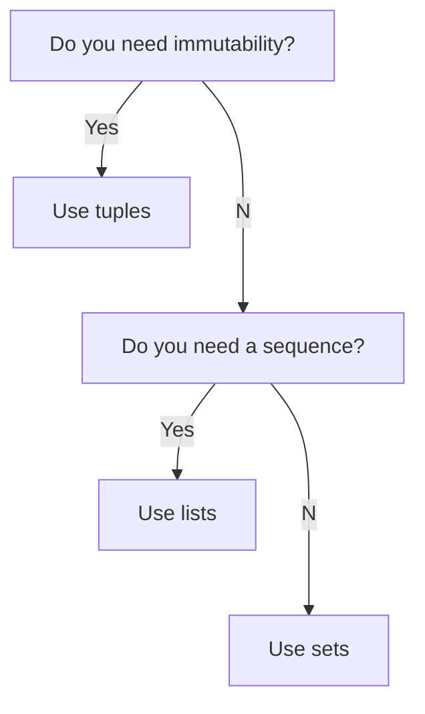

<script src="https://unpkg.com/vanilla-back-to-top@7.2.1/dist/vanilla-back-to-top.min.js"></script>

<script>addBackToTop()</script>

---

Welcome to the next topic, which covers an overview of the most essential python data types.

---
---

# 1. Scripts

<a href="{{ site.url }}{{ site.baseurl }}/courses/programming_in_python/04_data_types/scripts">Data types scripts</a>

---

# 2. Videos

<iframe width="560" height="315" src="https://www.youtube.com/embed/?playlist=,C_Y3bi19Sh8,N8sL98yHLW0,tsTqTvNfE6Q,EAp83Ua6olY,8hSVmAWjf94,EtdsquQSEs4,oyQ2ZCISAWM,JIUj2ERdvSU,cvdsw-KEzwQ,JdEXT9Pnc5w,C_qR3O8vGgw,fhltJtAn0BQ,UyAs711539s,MTly6c_tkfQ,o2mU9csk_MM," title="YouTube video player" frameborder="0" allow="accelerometer; autoplay; clipboard-write; encrypted-media; gyroscope; picture-in-picture" allowfullscreen></iframe>

Make sure that you have watched all the videos from this playlist!

- Introduction,
- Defining recap,
- Operations recap,
- Input function,
- f-Strings,
- Accessing characters,
- For loop,
- Slicing,
- Modifying,
- Looping once again,
- Logical operations,
- Comparisons,
- Built-in functions,
- Regular expressions,
- re pattern matching.

---
---

# 3. Introduction

<p align="center">
    
</p>

Image taken from [this site](https://pynative.com/python-data-types/).

You should already know the basics for the most of these data types. During the [Variables and constants](https://lazarskiopencourses.github.io/courses_in_english/introduction_to_programming_in_python/01_variables_and_constants/) module, we talked a bit about int and float numbers. We have also discussed [booleans](https://lazarskiopencourses.github.io/courses_in_english/introduction_to_programming_in_python/03_conditional_statements/), as well as [strings](https://lazarskiopencourses.github.io/courses_in_english/programming_in_python/02_strings_and_reg_express/). Finally, [the previous module](https://lazarskiopencourses.github.io/courses_in_english/programming_in_python/03_iterables/) contains material about lists, sets, tuples and dictionaries. Not bad at all. If you don't feel confident about some of the topics above, we recommend you to repeat them. Otherwise, let's start with complementing our knowledge about the mutable and immutable data types in Python.

---

---

# 4. Mutable vs. Immutable

You have most likely already heard phrases like "_strings are immutable_", "_lists are mutable_" or "_we cannot change elements of a string_". So far we have not spent much time explaining what exactly we mean by that. The reason was simple - you had to learn the basics to understand the difference between mutable and immutable objects. But now you know quite a bit. Hence, it's a good time to understand the concept of mutability.

Consider the following example code:

```python
a = [1, 2, 3]
b = a
b[1] = 4

print("Printing b: ", b)
print("Printing a: ", a)
```

What do you think will be the output of the first `print` call? What about the second one? Run the code and check if your intuitions were correct.

As you probably expected, the `b` list looks like this: `[1, 4, 3]`. There is no surprise there. We have changed the element at the first index to `4` instead of `2`.

The interesting part is in the second `print` output. The `a` list has also changed, even though we do not have any line of code which changes explicitly elements of `a`! If you want to understand the difference between a variable and the object which is stored inside the variable - this is the best example to analise. Let's go through this example in depth.

In the first line, Python creates an object which is a `[1, 2, 3]` list. This is the object itself. Python creates it and stores it somewhere in the memory. But there is also something else happening in the first line of code - we ask Python to create a variable named `a`. This variable's goal is to _point_ to the object we have created. If we need to do something with the created object, we will use this name when communicating with Python. So the variable is not an object itself. It's just a name for it.

It turns out that we can have multiple names for the same object. Just like in real life, the same person can be called by their name, e.g. `Sam`, but sometimes they can be referred to as `my_friend` or `my_gardener`. This is what happens in the second line of code. We tell Python to remember another name: `b` and that this name should point _to the same object_ as the name `a`.

This is why when we change the elements of a thing currently named `b`, the elements of a thing named `a` also change - these names refer to the same object! Whatever we do will affect the object - it does not matter by what name we will call it!

Having several names for one object is called _aliasing_. This makes sense - an _alias_ is another name for the same thing. In Python, we can have as many aliases as we want.

This should help you understand the difference between mutable and immutable objects. It should be now obvious to you that lists are mutable - we have just experienced that. We also know that strings are immutable. You can try to create a similar example for strings as the one above and you will fail to change the object. You can of course create multiple aliases for the same string. But you cannot change the string itself, so there is no risk of getting this weird behavior for strings.

This already shows the trade-off between mutable and immutable data types. Immutable data types are safer - there is no risk that you will change something when using one name and miss out that all other names will now also refer to the changed object. On the other hand, mutable objects give you more freedom. You do not have to create a new object whenever you want to change something.

---

## 4.1. IDs of immutable objects

Strings, floats, integers, bools, ranges and tuples are immutable data types. Let's check what is happening with our objects when we are performing simple operations. Let's define some variables with an int, a string and a float inside, respectively:

    >>> my_int = 2022
    >>> my_string = '2022'
    >>> my_float = 2.022

and check their identities (if you do not rememebr how `id` function works you can go back to [this chapter](https://lazarskiopencourses.github.io/courses_in_english/programming_in_python/02_strings_and_reg_express/):

    >>> id(my_int)
    4497530448
    >>> id(my_string)
    4495707376
    >>> id(my_float)
    4497527344

Now let's see what happens if we try to add something to our variables:

    >>> my_int += 1
    >>> my_string += ' year'
    >>> my_float += 0.001

Ask yourself - will the identities be the same? Well, they cannot be, because we are dealing with the immutable data type. If something has changed, a new object had to be created:

    >>> id(my_int)
    4497530384
    >>> id(my_string)
    4495707440
    >>> id(my_float)
    4494190160

So what must have happened is the following. Behind the scenes, Python created new objects based on the original ones. Then our variables started pointing to these new objects.

---

---

# 5. Numeric

## 5.1. Integers

All numeric data types are immutable. We already know integers from [this module](https://lazarskiopencourses.github.io/courses_in_english/introduction_to_programming_in_python/01_variables_and_constants/). In mathematics the set of integer numbers is denoted by $\mathbb{Z}$, and contains the numbers $\mathbb{Z}\in\{\dots,-3,-2,-1,0,1,2,3,\dots\}$.

```
>>> a = 5
>>> type(a)
int
```

Keep in mind that the type of number written in the form $5.0$ is different:

```
>>> a = 5.0
>>> type(a)
float
```

The result of an operation on integers doesn't have to be an integer:

```
>>> type(10 / 3)
float
```

---

If you would like to ensure yourself that you wrote some large number correctly, you can use `_` as a separator like that:

```py
>>> big_number = 12_380_000_000 
>>> big_number
12380000000
```

---

## 5.2. Floats

Floats are the equivalent of the rational numbers, denoted by $\mathbb{R}$ in math. In the case of these numbers, Python has got some limits, which can be checked by the following code:

```python
import sys
print(sys.float_info)
```

Which prints:

```
sys.float_info(max=1.7976931348623157e+308, max_exp=1024, max_10_exp=308, min=2.2250738585072014e-308, min_exp=-1021, min_10_exp=-307, dig=15, mant_dig=53, epsilon=2.220446049250313e-16, radix=2, rounds=1)
```

Above, you can see that there are a maximum and a minimum number we can use: `max=1.7976931348623157e+308` and `min=2.2250738585072014e-308` respectively. It is of course hard to imagine that some number of ours will be from outside of this range unless somebody deals with some combinatorial task.

Another limitation is that floats have a finite amount of digits. Therefore you cannot store an exact value of e.g. number $\pi$ as a float - you would need an infinite number of digits to do so. As you will most likely learn at some point of your programming career - this has significant implications, because a computation on floats can often lead to a slighlty incorrect result. For one computation this might not be a problem. But if you have multiple computations which depend on each other, these errors can accumulate. As a result, in a computationally complicated problem, if you do not approach it with care, you might get vastly incorrect result.

Just as a reminder, using the `int` function, we can transform float number into an integer:

```
>>> int(6.2)
6
>>> int(6.7)
6
```

Which always returns floor of a particular number.

---

## 5.3. Complex numbers

There is no need to load any external library to make some operations on complex numbers. But in the case of using the default programmed methods, one has to remember that in Python imaginary part of the complex number is denoted by $j$, not $i$. Python follows the electrical engineering convention. You can define a complex number in these two ways:

```
>>> e = 1 + 2j
>>> f = complex(1, 2)
>>> e == f
True
>>> print(type(e))
<class 'complex'>
```

Don't worry if at this time you don't know anything about complex numbers. More methods from this class are listed below.

```
>>> print('real part:\t\t', e.real, '\nimaginary part:\t\t', e.imag, '\nconjugate:\t\t', e.conjugate(), '\nmodulus:\t\t', abs(e)) 
real part:               1.0 
imaginary part:          2.0
conjugate:               (1-2j)
modulus:                 2.23606797749979
```

In order to get the phase of a complex number, you can do the following:

```
>>> import cmath
>>> print(cmath.phase(e))
1.1071487177940904
```

---

---

# 6. Boolean

Booleans are also immutable data types. You should know from [this module](https://lazarskiopencourses.github.io/courses_in_english/introduction_to_programming_in_python/03_conditional_statements/) that there are two keywords: `True` and `False`, which have a specific type, which is boolean.

```
>>> type(True)
<class 'bool'>
>>> type(False)
<class 'bool'>
```

We can use them directly or define some logical conditions, for instance `abs(a) < abs(b)`, which will be transformed by Python into True or False depending on the result. Python uses the results of those transformations when the `if-elif-else` structure is execute. It is worth noticing that in most programming languages, `True` is equivalent to `1` and `False` to `0`. In Python, it is no different.

```
>>> True == 1
True
>>> False == 0
True
```

Although, `0` and `1` are from a different class. To transform these numbers to booleans, we can use the bool function.

```
>>> bool(1)
True
>>> bool(0)
False
```

Empty objects evaluate to `False`. So does the `None` keyword. This can be very handy and help you with compressing your conditional statement structures:

```
>>> bool('')
False
>>> bool('something')
True
>>> bool([])
False
>>> bool([1,2,3])
True
>>> bool(None)
False
```

This allows you to write brief `if` statements. For instance, the following code:

```python
if some_list != []: # or len(some_list) > 0:
    ...
else:
    ...
```

which explicitly checks if `some_list` is equal to an empty list, will give you exactly the same result as this code:

```python
if some_list:
    ...
else:
    ...
```

which simply treats `some_list` as `False` if it is an empty list or if it is a `None` objects.

---

---

# 7. Sequence Type

If an objects contains ordered set of elements inside, then it is a sequence. That's why strings, tuples and lists are sequences and the rest of data types we know are not. Let's complement our knowledge from the perspective of immutable vs. mutable data types.

---

## 7.1. Lists

Let's create a

```py
>>> dog_breeds = ['buldog', 'labrador', 'chihuahua', 'husky', 'akita', 'dalmatian', 'pug', 'boston terrier', 'boxer']
```

list so that we can use it as an example when discussing different list methods.

### 7.1.1. `copy` method

Since lists are mutable objects, it is always good to have a copy of our original list. This way we can compare the results we obtain. So let us use the `copy` method:

```py
>>> dog_breeds_copy = dog_breeds.copy()
```

If we had written `dog_breeds_copy = dog_breeds` we would have just created an alias for the same object. Any changes applied to `dog_breeds` would apply also to `dog_breeds_copy` - and vice versa. However, this is not the case if we use the `copy` method. What happens then is that python creates an identical object which simply has the same elements. But it is not the same object! Only values are the same. You can confirm this by checking the identity of two objects:

    >>> id(dog_breeds)
    4334950848
    >>> id(dog_breeds_copy)
    4336211776

Hence in this case `dog_breeds_copy` is an independent object, so any changes applied to it will not affect `dog_breeds` and vice versa. If this is not clear to you, you should do a recap of the section about mutability.

Another possibility to create a copy and not an alias is to use slicing:

    dog_breeds_copy = dog_breeds[:]

Create a copy of a list in this manner and confirm that the identities of your objects are different.

---

### 7.1.2. `==` and `is` operators

So now we have two `lists` which contain the same elements. If we want to check if some two `lists` are identical, we can use the `==` operator:

    >>> dog_breeds == dog_breeds_copy
    True

Note that `==` checks only if the elements of two `lists` are the same and in the same order. It does not check if the two variables point to the same object. We can do the latter using the `is` operator:

    >>> dog_breeds is dog_breeds_copy
    False

---

## 7.2. Dicts

### 7.2.1. Immutable keys in mutable dict()

Dictionaries are useful data types that are mutable by definition. As you know, after creating a dictionary, we can easily modify it - both its keys and values. You also know that dictionaries are constructed in such a way that the data is stored as `key:value` pairs. By definition, dictionaries cannot have more than one item with the same key. Let us now create a simple `dict()` and then we will test it.

    >>> abbrev = {"UK":"United Kingdom", "ME":"MONTENEGRO", "TO":"TONGA", "AE":"UNITED ARAB EMIRATES","GR":"GREECE"}

Now we can easily access a specific element of `abbrev` by specifying a `key`:

    >>> abbrev['GR']
    'GREECE'

Now, let's say we have asked people around the world what should be the abbreviation for GREECE, GREENLAND and GRENADA. Probably most of our respondents will answer GR for each. This of course wouldn't be of any use, because than we wouldn't know what the `'GR'` abbreviation stands for. It's the same with python dictionaries:

    >>> abbrev['GR'] = 'GREENLAND'
    >>> abbrev['GR'] = 'GRENADA'
    >>> abbrev
    {'UK': 'United Kingdom', 'ME': 'MONTENEGRO', 'TO': 'TONGA', 'AE': 'UNITED ARAB EMIRATES', 'GR': 'GRENADA'}

As you can see, python kept only the last value assigned to the key `'GR'`. This is because we cannot have two different values assigned to the same key in a dictionary.

We have already discussed this - you might say and indeed you would be right. However, what we have not discussed in detail is what follows from the required uniqueness of the `keys` in a dictionary: one cannot use mutable objects as `keys`! Why is that? Well, imagine that you could create a dictionary with the following code - as you can see, if you try you will get an error:

    >>> x = [1,2]
    >>> y = [1,2,3]
    >>> incorrect_dict = {x:'A', y:'B'}
    Traceback (most recent call last):
      File "`<stdin>`", line 1, in `<module>`
    TypeError: unhashable type: 'list'

But imagine that you could do it. What would have happened if in the next line you wrote:

    >>> y.remove(3)

Well, you would change the object to which the variable `y` is pointing. This object was the key in your dictionary. Moreover, after your changes this object is identical to another key in your dictionary, namely the obejct to which the variable `x` was pointing. So, you would get a dictionary with two identical `keys` which have different `values` assigned to them!

---

## 7.3. Tuples

### 7.3.1. no-brackets definition

Tuples can be defined without brackets. For example:

```
>>> one_element_tuple = 1,
>>> one_element_tuple
(1,)
```

A tuple is a default data type that stores some objects. You don't have to write (1, 2, 3), you can just write a tuple without parentheses 1, 2, 3. You can verify that this to approaches give you the same result with the following code:

```
>>> a = (1, 2, 3)
>>> b = 1, 2, 3
>>> a == b
True
```

Check what will happen if we try to write:

```
>>> (1, 2, 3) == 1, 2, 3
```

and try to understand why it is happening. If you don't have a clue, extend the following:

---

<details>
    <summary>Explanation</summary>

  In Python, commas have lower precedence than the operator `==`. So in this case the first thing Python does is to evaluate the result of `(1, 2, 3) == 1`. Then it combines this result with the other numbers 2 and 3 and produces a tuple with values `(False, 2, 3)`. Try to guess what will happen here:

```
    >>> a = 1, 2 == 1, 2
    >>> a
    ?
```

  Moreover, commas have lower precedence than almost all operators except for assignment operators such as `=`, `+=` etc. That is why assignment operation as:

```python
  >>> x, y = 1, 2
```

  works as expected and memorizes numbers 1 and 2 in the variables x and y. We will talk about this way of assignments in the next module.

</details>

### 7.3.2. `tuples` are immutable

Now you may wonder if an example which we have discussed at the very beginning of this chapter is also valid for `tuples`. Let us try. This will help us determin whether `tuples` are mutable or immutable data types. Let's start with simply replacing `[]` with `()` during object creation:

```python
a = (1, 2, 3)
b = a
b[1] = 4

print("Printing b: ", b)
print("Printing a: ", a)
```

When you call these few lines of code you will see an **error** stating that the `tuple` object does not support item assignment`:

```
---------------------------------------------------------------------------
TypeError                                 Traceback (most recent call last)
/tmp/ipykernel_138735/1157130565.py in <module>
      1 a = (1, 2, 3)
      2 b = a
----> 3 b[1] = 4
      4 
      5 print("Printing b: ", b)

TypeError: 'tuple' object does not support item assignment
```

This error is related to the properties of immutable data types to which `tuple` belongs. Basically, we cannot modify a `tuple` object. Hence, if we are trying to _assign_ a new value to the element `b[1]`, we get an error. This wasn't a problem when we were using lists, because they are mutable objects.

---

### 7.3.3. Extending a tuple

We cannot 'modify' a tuple, hence we cannot add something at the end of it. Instead, whenever we are performing an operation like this we need to create a new tuple containing the elements from the old one plus the added objects. Let us see this in an example below:

```py
my_tuple= (1,2,3,4)
id_of_my_list = id(my_tuple)
print(f'Printing id of my_list : {id_of_my_list}')
print(f'my_tuple before extend: {my_tuple}')
my_tuple += (0,8,1,2)
id_of_my_tuple  = id(my_tuple)
print(f'Printing id of my_list after expansion: {id_of_my_tuple}')
print(f'my_tuple after extend: {my_tuple}')
```

We are creating a `my_tuple` variable with `(1, 2, 3, 4)` tuple inside. Then we want to append a `(0,8,1,2)` tuple to it. We simply use the expression `my_tuple += (0,8,1,2)`, which on the surface has similar behaviour as for lists, but actually works very differently. The `(0,8,1,2)` is not added to the existing tuple. Instead, a new tuple is created - you can see that by checking that the id of the object has changed.

```py
Printing id of my_list : 140219859623088
my_tuple before extend: (1, 2, 3, 4)
Printing id of my_list after expansion: 140219858794880
my_tuple after extend: (1, 2, 3, 4, 0, 8, 1, 2) 
```

---

Create a similar example for lists - simply replace round brackets with square ones - and check that in case of lists the id does not change.

---

### 7.3.4. Immutable containers with mutable objects

Until now, you have been using mutable and immutable objects independently, but sometimes it is necessary to combine them together. The common example of such a usage is having a tuple with many lists assigned as values. This means that our immutable container `tuple` contains a reference to some mutable objects, e.g. lists. Let us see how it may work:

```py
customer_currency_accounts = ['USD', 'EUR', 'GBP', 'CHF']
customer_info = (123654789, customer_currency_accounts)
print(f'ID before modification - {id(customer_info)}')

customer_currency_accounts.pop()
print(customer_info)
print(f'ID after modification - {id(customer_info)}')
```

We are creating a `customer_currency_accounts`, which is a list , and then we define a `customer_info` - tuple. Then we can check the `id()`. The next step is just a simple modification of a list; the last value is deleted. When we print our tuple we can see that despite the fact that this is an immutable object, which was not modified, its value has changed. This change was caused by the change in the mutable object (list).

    ID before modification - 140710684230720
    (123654789, ['USD', 'EUR', 'GBP'])
    ID after modification - 140710684230720

Notable is the fact that such an operation works only in case of an immutable container that contains mutable objects. For other scenarios, it does not work that way.

---

---

# 8. Benchmark tournament - lists vs. sets vs. tuples time performance

Let's deal with some time performance statements about these data types. We want to check which of them performs better in four disciplines:

1. defining an iterable as a specific data type,
2. modyfing an iterable
3. checking if a particular object contains a specific element,
4. defining variables from accessed elements,
5. accessing elements.

In order to be able to repeat all the tests, you need to import the [timeit module](https://docs.python.org/3/library/timeit.html). Keep in mind that results on your computer may differ much because you have a different system, version of Python, and CPU. We use the repeat function, which stores a determined number of best results and takes the minimum value from them. It seems to be a good approach to avoid some distortions caused by other computations currently happening on your computer. We start with the task of defining a sequence. In the following subsections, `s` stands for seconds, `ms` stands for milliseconds, `μs` for microseconds and `ns` for nanoseconds.

---

## 8.1. Initialization

After executing the `01_init.py` script, you should see something similar to:

```
Initializing an object with elements 'Banach','Ulam','Steinhaus'
Lists:
Time in μs: 0.03522, Size in bytes: 88
Tuples:
Time in μs: 0.00943, Size in bytes: 64
Sets:
Time in μs: 0.06080, Size in bytes: 216

Initializing an object with elements 0,1,...,999
Lists:
Time in μs: 2.03822, Size in bytes: 8056
Tuples:
Time in μs: 0.01081, Size in bytes: 8040
Sets:
Time in μs: 3.57472, Size in bytes: 32984
```

We use the `timeit.repeat` function which returns the sum of time executions of a particular instruction. If you would prefer to see time execution of one operation in seconds, you should divide the result by the *number* argument. Since we use `number=1000000`, these numbers might be interpreted as results in microseconds.

The obvious winner is a tuple both in time performance and the size. Lists need over-allocation to make the `.append` method work in linear time. Since tuples are immutable data types, they can have the smallest size. As we see, sets are the largest and need the most time to define, but let's keep in mind that what we see is a time in microseconds and size in bytes. Maybe we will find out later that it pays off to wait for a few microseconds and use a few thousand bytes more because of the optimization of some other operations.

---

## 8.2. 6.2 Modifying

We need to remember that even if tuples are much faster to define, they don't have the functionality to add items in place. They need to be redefined, and a new object has to be created. Let's check which of these data types performs better in the case of adding new elements executing `02_add.py` script.

```
Adding numbers 0,1,2,...,9 to predefined object
Time in ms:
Lists:  0.000559099949896
Tuples: 0.000736499903724
Sets:   0.000655099982396

Adding numbers 0,1,2,...,999 to predefined object
Time in ms:
Lists:  0.039258299861103
Tuples: 0.834617200074717
Sets:   0.043720799963921
```

As we might have expected, tuples perform the worst in this kind of situation. But the difference between sets and lists doesn't seem to be significant this time.

---

## 8.3. *in* operator

After executing  the `03_in_operator.py` script, you should see something similar to:

```
Element exists in data.

Operation:
'Andes in 'Andes', 'Carpathians', 'Alps', 'Himalayas'?

Time performance in ms:
Lists:  0.000021600048058
Tuples: 0.000020200037397
Sets:   0.000021400046535

Operation:
50000 in 0,1,2,...,99999?

Time performance in ms:
Lists:  0.268205099971965
Tuples: 0.318026300054044
Sets:   0.000029599992558

Element doesn't exist in data.

Operation:
'Sudetes in 'Andes', 'Carpathians', 'Alps', 'Himalayas'?

Time performance in ms:
Lists:  0.000039999955334
Tuples: 0.000044499989599
Sets:   0.000021400046535

Operation:
100000 in 0,1,2,...,99999?

Time performance in ms:
Lists:  0.543594500049949
Tuples: 0.643625600030646
Sets:   0.000022699940018
```

As you see, sets tend to perform significantly better than other data types. The time execution of this operation for sets is constant, whereas for others it depends linearly on the length of a sequence. Tuples tend to be the slowest, although we have noticed earlier that they should be faster than lists because of immutability. It seems that it is not so obvious and it depends on the version of Python and your computer configuration. On Python 3.10, if you don't need the optionality of accessing elements by index, the best is to use sets.

---

## 8.4. Defining variables

After executing the `04_def_variables.py` script, you should see something similar to:

```
Conducting an operation: x, y, z, w = 3, 2, 1, 0 whereas the right side is either list, tuple or set.

Time in μs:
Lists:  0.023264299845323
Tuples: 0.021340300096199
Sets:   0.069727400084957
```

The conclusion is that the easiest data type to access some elements and define variables from is a tuple. But the difference between a tuple and a list doesn't seem to be significant. Sets perform the worst, but this operation doesn't seem to have utility, since we don't know which of the variables x, y, z would have which value from 1, 2, 3 assigned.

---

## 8.5. accessing elements

After executing the `05_access.py` script, you should see something similar to:

```
Conducting an operation: items[2]

Time in μs:
Lists:  0.022230699891225
Tuples: 0.024533499963582
```

We compared only lists and tuples since sets are not subscriptable. Again, lists won, although we thought that the result will be different. The situation is the same as through *in* operator case.

---

## 8.6. Conclusions

Based on the results of benchmarks and results from my computer, we propose you the following way of choosing a particular data type to store some objects.

<p align="center">



</p>

Why would you need immutability? For example, to prevent the situation when you accidentally modify the content of a particular object. If you are sure that it will not happen, sets or lists should be more efficient to use. We could extend this graph by adding to the right side the same question `Do you need a sequence?` and append a `frozenset` type of object, but we didn't cover it. The winners of a particular competition (it may be different on your machine):

| initializing | appending | *in* operator | defining vars | accessing |
| ------------ | --------- | --------------- | ------------- | --------- |
| Tuples       | Lists     | Sets            | Tuples        | Lists     |

---
---

# 9. Immutable vs. mutable summary

Here we provide you with a table which shows which objects are mutable and which are immutable:

| Mutable              | Immutable                                                    |
| -------------------- | ------------------------------------------------------------ |
| list                 | int, float                                                   |
| dictionary           | [decimal](https://docs.python.org/3/library/decimal.html), bool |
| set                  | string, tuple                                                |
| user-defined classes | range                                                        |

---
---

# 10. Exercises

## 10.1. EX. 1 (5 points)

This time quiz, which can be found on gradescope, is your task. Good luck!

---

## 10.2. EX. 2 (1 point)

Define a function called `intersection`, which takes an arbitrary number of sets and returns the intersection of all given arguments. For example:

```py
>>> intersection({1,2}, {2,5})
{2}
>>> intersection({'dog', 'cat', 'lion'}, {'cat', 'lizard', 'dog', 'giraffe'}, {'monkey', 'hippo', 'dog', 2, 'cat'})
{'dog', 'cat'} # or {'cat', 'dog'}
>>> intersection()
{}
>>> intersection({2.72, 1.62})
{1.62, 2.72} # or {2.72, 1.62}
>>> intersection({1,2,3}, {5,6,7})
{}
```

Good luck!

---

**Note:**

What could improve the time performance of our function? Assume that we are dealing with 100 thousands of significantly long sets. It may happen that after calculating the intersection of the first few and the next we get an empty set. The intersection of an empty set with any set is an empty set. So after getting an empty set we can return it and save a significant amount of time.

---

## 10.3. EX. 3 (1 point)

Define a function named `employees_update`, which takes an arbitrary number of tuples as arguments having the following form: `(name, age)`. The assumption is that you have a list called `employees` defined outside a function, which stores all the tuples with information about employees and which will be updated each time the `employee_update` function is executed. The aim of the function is to store those employees alphabetically. The functionality should be as follows:

```py
>>> employees = []
>>> employees_update(('Mark', 19), ('Anna', 22))
>>> employees
[('Anna', 22), ('Mark', 19)]
>>> employees_update(('Pam', 20), ('Zack', 24), ('Brian', 21))
>>> employees
[('Anna', 22), ('Brian', 21), ('Mark', 19), ('Pam', 20), ('Zack', 24)]
>>> employees_update(('Natalie', 23))
>>> employees
[('Anna', 22), ('Brian', 21), ('Mark', 19), ('Natalie', 23), ('Pam', 20), ('Zack', 24)]
```

You need to include `employees = []` in your script. Good luck!

---

## 10.4. EX. 4 (1 point)

Define a function named **heterogram**, which takes one string and checks if it is a heterogram, returning True or False respectively. [Heterograms](https://en.wikipedia.org/wiki/Heterogram_(literature)) are sentences in which all the letters occur only once. One of the longest heterogram words in English is `subdermatoglyphic` (17 characters). The phrase `cwm fjord bank glyphs vext quiz` is also a heterogram, and what's more, it is a perfect pangram since all the letters from the alphabet are used. Unfortunately, it is also incomprehensible. Examples:

```py
>>> heterogram('subdermatoglyphic')
True
>>> heterogram('is that a heterogram?')
False
>>> heterogram('abc, d e, fgh.')
True
>>> heterogram('cwm fjord bank glyphs vext quiz')
True
```

Again, a string with all letters from the English alphabet may be helpful: `abcdefghijklmnopqrstuvwxyz`. To avoid the situation in which some sentence is a heterogram but has some doubled characters which are not letters. Good luck!

---

## 10.5. EX. 5 (1 point)

Your task is to define a function called **converter**, which accepts a tuple with numbers and converts them into one number respectively to the order of the numbers. For example:

```py
>>> converter((1, 2, 4))
123
>>> converter((4, 21, 90))
42190
>>> converter((5,))
5
```

Good luck!

---

## 10.6. EX. 6 (1 point)

Define a function called `difference` with one integer argument. The return should be the difference between the biggest and the lowest numbers, which can be written using the digits from the argument. For example:

```py
>>> difference(45312)
41976 # since 54321 - 12345 = 41976
>>> difference(39401420)
94308651 # since 94432100 - 123449 = 94308651
>>> difference(222)
0
```

Good luck!